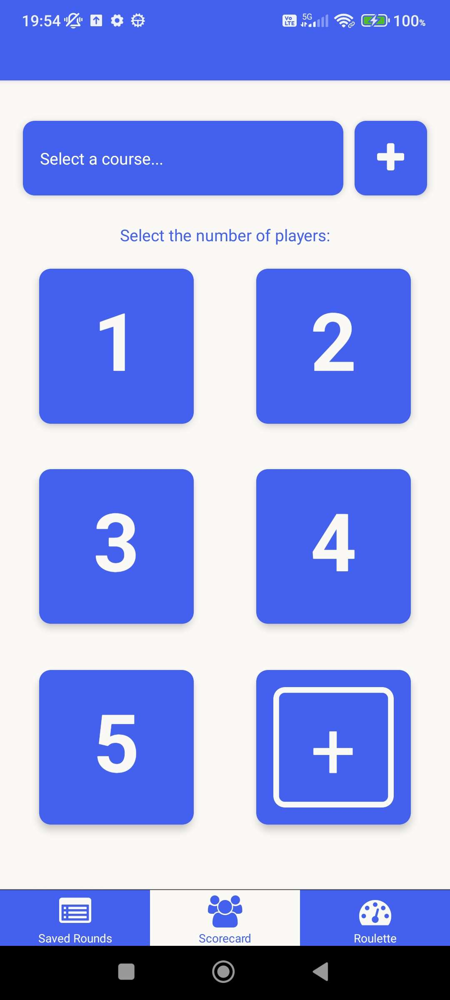
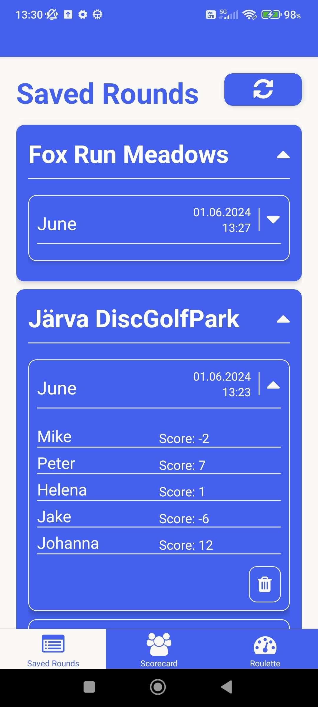
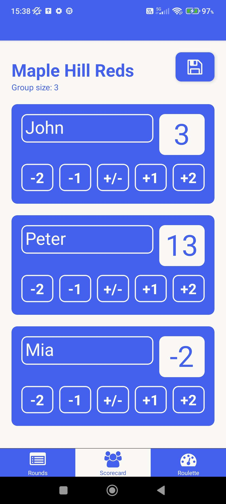
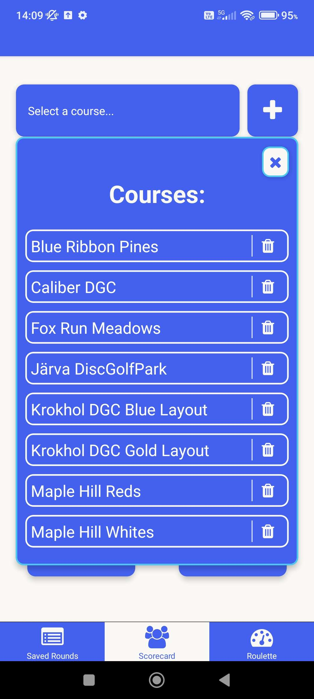
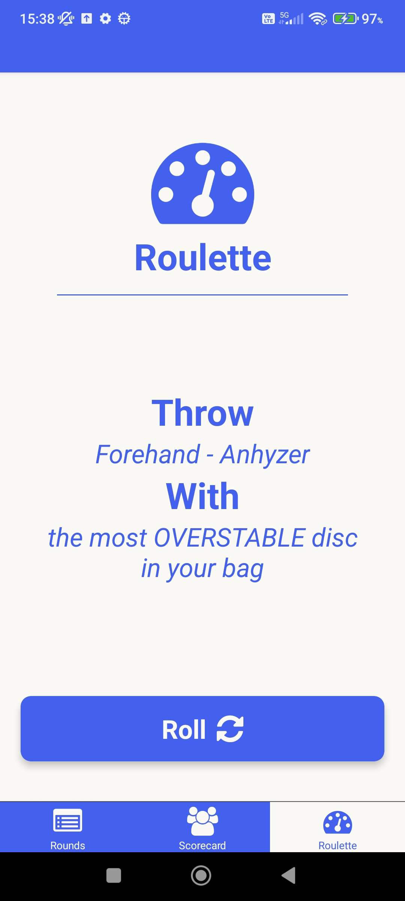

# discScore
*A simple personal project for disc golf score counting*

- Simple score counting
- Choose a group size
- Save courses and round scorecards
- Disc golf randomised shot roulette
- Easy and fast to use on the course

  
 

React Native, Expo Router, TypeScript, Async Storage